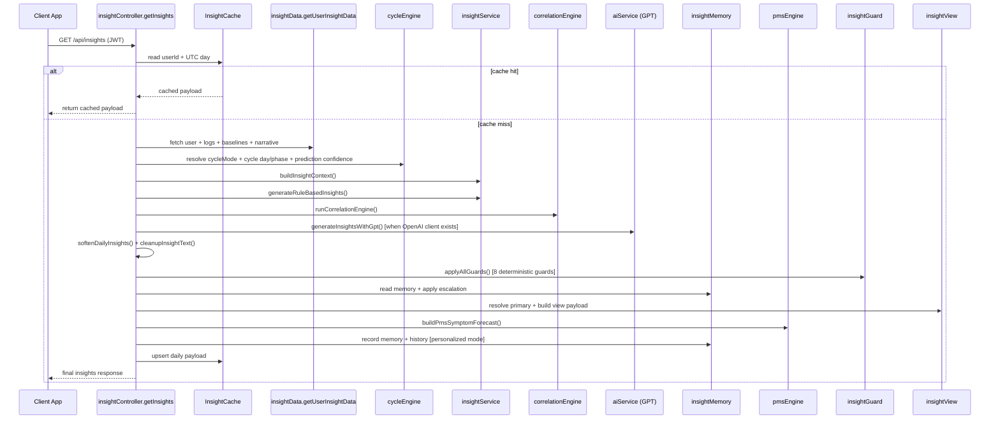
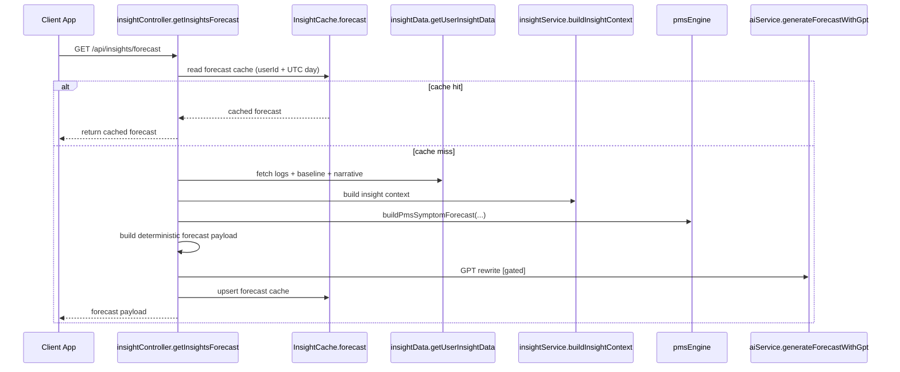

# Vyana Insights Flow (Detailed)

This document explains the end-to-end runtime flow for:

- daily insights
- forecast insights
- PMS forecast/warmup
- health pattern detection
- GPT usage gates
- new-user behavior

It reflects the current code in:

- `src/controllers/insightController.ts`
- `src/services/insightService.ts`
- `src/services/aiService.ts`
- `src/services/pmsEngine.ts`
- `src/services/healthPatternEngine.ts`
- `src/controllers/healthController.ts`
- `src/services/cycleEngine.ts`
- `src/services/insightData.ts`
- `src/services/insightGuard.ts`
- `src/services/insightCause.ts`
- `src/services/insightMonitor.ts`

---

## 1) Big Picture

There are 4 insight products running on top of shared cycle + log data:

1. `GET /api/insights` -> daily insight cards + view payload
2. `GET /api/insights/forecast` -> tomorrow/next-phase forecast
3. PMS forecast state -> warmup or full symptom forecast (embedded in forecast; warning in daily insights)
4. `GET /api/health/patterns` -> medical-pattern alerts + watching states

Rule engine is always the source of truth. GPT is a **rewrite layer** for daily insights on each cache miss when OpenAI is configured; **forecast** GPT is still **gated** (see §9).

---

## 2) Request Lifecycle (Daily Insights)

Endpoint: `GET /api/insights`

### Sequence

---

## 3) Data Inputs and Derived Context

`getUserInsightData(userId)` in `src/services/insightData.ts` returns:

- `recentLogs`: last 7 logs
- `baselineLogs`: older logs from the same 90-day fetch
- `numericBaseline`:
  - recent and baseline averages for sleep/stress/mood/energy
  - deltas like `sleepDelta`, `stressDelta`, `moodDelta`
- `crossCycleNarrative`:
  - similar-window behavior from prior cycles
  - trend (`improving`, `worsening`, etc.)

Cycle layer (`src/services/cycleEngine.ts`) adds:

- `cycleMode`: `natural` | `hormonal` | `irregular`
- dynamic phase boundaries by cycle length
- current `phase`, `cycleDay`, `daysUntilNextPhase`, `nextPeriodDate`
- prediction confidence from cycle-length variability

---

## 4) Insight Engine Internals (Rule-Based Core)

`buildInsightContext(...)` in `src/services/insightService.ts` computes:

1. Signals (`buildSignals`)
   - normalized sleep, stress, mood, exercise
   - bleeding load from `padsChanged`
   - physical/mental/emotional state
   - interaction flags (enabled only with at least 3 logs)

2. Trends (`buildTrends`)
   - trend direction for sleep/stress/mood
   - sleep/mood variability

3. Baseline deviation (`buildBaselineDeviation`)
   - recent-vs-baseline sleep and stress shifts

4. Mode and confidence
   - `mode = personalized` if enough logs or strong signal
   - otherwise `fallback`
   - confidence from log volume + signal/trend richness

5. Priority drivers
   - weighted ranking of active drivers
   - includes day-level physical boost on biologically hard days

`generateRuleBasedInsights(ctx)` then generates:

- `physicalInsight`
- `mentalInsight`
- `emotionalInsight`
- `whyThisIsHappening`
- `solution`
- `recommendation`
- `tomorrowPreview`

Fallback mode uses day/phase library text; personalized mode uses user signal state.

---

## 5) Correlation, Memory, Rotation, and View

Inside `getInsights`:

1. Correlation overlay (`runCorrelationEngine`)
   - if confidence high, can override headline/action/why
   - keeps critical physical protection for `bleeding_heavy` and `high_strain`

2. Cross-cycle narrative injection
   - appends cycle-memory context to `whyThisIsHappening`

3. Memory system (`insightMemory`)
   - reads count per driver
   - supports decay/reset after inactivity
   - escalates wording when patterns persist

4. Repetition suppression (`insightView`)
   - can rotate primary insight key if same primary repeats
   - skips suppression for critical physical drivers

5. Final response shaping
   - `insights`
   - `view`
   - `v2` condensed card structure
   - `basedOn` reasoning metadata
   - `cycleContext`, `numericSummary`, `memoryContext`, optional `pmsWarning`

### 5.5 Post-Generation Guard Layer

After GPT rewriting and text cleanup, `applyAllGuards()` runs 8 deterministic guards:
- Zero-data assertion softening
- Direction enforcement (no negatives during improving phases)
- Intensity limiting
- Hallucination filtering
- Technical language conversion
- Tomorrow softening
- Capitalization repair
- Cross-field consistency validation

The guard runs in <1ms, has no async calls, and never makes text worse. High-data users (5+ logs) pass through with minimal changes.

---

## 6) Forecast Flow (`GET /api/insights/forecast`)

### Sequence

Forecast payload includes:

- `today` (phase/day/confidenceScore/priority drivers)
- `forecast.tomorrow`
- `forecast.nextPhase`
- `forecast.confidence`
- `pmsSymptomForecast` (warmup or full)
- optional `forecastAiEnhanced`

---

## 7) PMS Forecast Logic

`buildPmsSymptomForecast(...)` in `src/services/pmsEngine.ts`:

1. Non-luteal -> return `null`
2. Build late-luteal historical windows from prior driver history
3. If <2 windows -> return warmup state:
   - `warmup: true`
   - progress (`cyclesSoFar/cyclesNeeded`)
   - message + tip + logging prompt
4. If enough windows:
   - map drivers to symptom labels (`DRIVER_TO_SYMPTOM`)
   - keep symptoms recurring across recent cycles
   - compute symptom window (`startDay`, `peakDay`)
   - return confidence + headline + action

This gives a progressive experience:

- new/insufficient cycle history -> warmup coaching
- enough history -> actual symptom forecast

---

## 8) Health Pattern Flow (`/api/health/patterns`)

Endpoint: `GET /api/health/patterns` in `src/controllers/healthController.ts`.

### Runtime behavior

1. Check `HealthPatternCache`
2. If cache fresh (currently 1-day TTL), return cached result
3. Else run `runHealthPatternDetection(...)` and cache the result

### Engine outputs (`src/services/healthPatternEngine.ts`)

- `alerts[]` (full threshold reached)
  - `pcos_indicator`
  - `pmdd_indicator`
  - `endometriosis_indicator`
  - `iron_deficiency_risk`
- `watching[]` (early signals, not enough cycles yet)
- mandatory disclaimer/action in each full alert

Period-start trigger (`POST /api/cycle/period-started`) also recomputes health patterns after cycle update if there are enough completed cycles.

---

## 9) GPT Gating Rules (Exactly When GPT Runs)

### Daily insights GPT (`generateInsightsWithGpt`)

On a **cache miss**, the controller calls `generateInsightsWithGpt` whenever the OpenAI client is configured (`OPENAI_API_KEY`). There is **no** controller-level gate on log count, `mode`, or confidence — **brand-new users (0 logs)** still invoke this path.

Inside the service, if the client is missing, the function returns immediately with `status: "client_missing"` and the deterministic draft.

If the API call fails, JSON is invalid, or guards reject output → keep / fall back to deterministic draft (see controller + `insightGptService`).

**Circuit breaker:** After 5 consecutive GPT failures, the circuit opens for 5 minutes. During cooldown, all insight requests serve the deterministic draft. The circuit auto-recovers after cooldown. All GPT calls have an 8-second timeout.

### Forecast GPT (`generateForecastWithGpt`)

Called only when **all** are true (see `insightController.getInsightsForecast`):

- `logsCount >= 7`
- `context.mode === "personalized"`
- `context.confidence !== "low"`
- OpenAI client configured

The forecast **endpoint** can still return a **warmup** payload (no full forecast) when `checkForecastEligibility` fails — in those cases forecast GPT does not run.

### Chat GPT (`askVyanaWithGpt`)

Independent endpoint; runs when OpenAI is configured, otherwise a non-AI fallback message is returned.

---

## 10) New User Behavior

### 0 logs

- usually `fallback` mode
- phase/day grounded reasoning
- low confidence
- **Daily insights GPT may still run** on a cache miss if `OPENAI_API_KEY` is set (controller does not gate on log count)
- limited trend/interaction claims from sparse data

### 1-2 logs

- may enter `personalized` mode if **strong signal** exists (`insightService.modeFor`)
- confidence often still low
- daily GPT path same as above when OpenAI is configured

### 3+ logs

Rule engine “full” personalization unlocks:

- trend + interaction logic
- baseline deviation
- correlation overlays
- memory escalation and rotation

Forecast **GPT** remains gated separately (7 logs + personalized + not low confidence). Forecast **availability** also requires `checkForecastEligibility` (7 logs, 5-day spread, confidence score, contraception not disabling forecast).

---

## 11) Cache and Invalidation

- `InsightCache` stores daily insights and forecast by UTC day
- `HealthPatternCache` stores health pattern payload
- `saveLog` in `src/controllers/logController.ts` deletes both caches:
  - `insightCache.deleteMany({ userId })`
  - `healthPatternCache.deleteMany({ userId })`

So every new log forces fresh recomputation on next fetch.

Additionally, `periodStarted` clears InsightCache, and `editLog` (PUT /api/logs/:id) and `quickCheckIn` (POST /api/logs/quick-check-in) also invalidate both caches.

---

## 12) One-Line Mental Model

Vyana first computes a deterministic, explainable, cycle-aware draft from logs + cycle state; **daily** insights then optionally pass through GPT for tone (when configured), followed by a **deterministic guard layer** that catches zero-data overconfidence and hallucinations. **Forecast** GPT and full forecast payload are stricter and remain eligibility-gated.

---

### Scenario L: Zero-Data User Guard Verification

Endpoint: `GET /api/insights` (user with 0 logs)

Expected behavior:
- All insight text uses suggestive framing ("can", "may", "tends to", "often")
- No assertive state claims ("Energy is lower", "Focus is harder")
- No hallucinated physical claims ("pelvic awareness", "tingling")
- No technical jargon ("hormone floor", "LH surge", "cervical mucus")
- tomorrowPreview uses "may" not "will"
- No contradictions between fields

The insightGuard layer enforces this even when GPT ignores prompt instructions.

---

## 13) Scenario-to-Response Mapping

Use this as a fast regression checklist for QA and API validation.

### Scenario A: Brand-New User (0 logs)

Expected behavior:

- `isNewUser = true`
- `progress.logsCount = 0`
- `mode` typically `fallback`
- `confidence` low
- `aiEnhanced` **may be `true`** if GPT ran and changed text vs the draft (OpenAI configured)
- `insights` start from deterministic rules, then optional GPT rewrite
- `basedOn.interactionFlags` empty
- `basedOn.trends` likely empty/insufficient
- no strong cross-signal claims

Look for in response:

- `insights.whyThisIsHappening` should be phase-grounded
- action/recommendation should encourage logging consistency

### Scenario B: Early User (1-2 logs) with Strong Distress Signal

Example: heavy bleeding + poor sleep + high stress.

Expected behavior:

- may still be `mode = personalized` (strong signal override)
- confidence remains low due to data depth
- `aiEnhanced` may be `true` if GPT ran and altered copy (OpenAI configured)
- priority drivers include severe physical/stress signals
- conservative but specific phrasing in insights

Look for in response:

- `basedOn.priorityDrivers` contains distress drivers
- `insights.physicalInsight` reflects bleeding/strain if present
- no overconfident long-term trend claims

### Scenario C: Personalized User (3+ logs), Luteal Stress + Sleep Decline

Expected behavior:

- `mode = personalized`
- trend + interaction logic active
- baseline deviations can trigger (`sleep_below_personal_baseline`, `stress_above_personal_baseline`)
- memory context starts influencing escalation
- daily GPT may run whenever OpenAI is configured; output still softened by confidence

Look for in response:

- `aiEnhanced` may be `true` or `false` depending on whether GPT changed the draft
- `memoryContext` present (driver/count/severity)
- `basedOn.trends` and `basedOn.interactionFlags` populated
- `crossCycleNarrative` may be present if enough cycle history

### Scenario D: Heavy Bleeding Day (Critical Physical Signal)

Expected behavior:

- priority includes `bleeding_heavy` (high rank)
- primary insight suppression should not rotate away from critical physical focus
- recommendations emphasize immediate recovery actions

Look for in response:

- `home.primaryDriver = bleeding_heavy` (or equivalent top physical driver)
- physical-first messaging in `insights` and `view`

### Scenario E: Irregular Cycle User

Expected behavior:

- `cycleContext.cycleMode = irregular`
- `cycleContext.cyclePredictionConfidence` often `variable` or `irregular`
- `cycleContext.nextPeriodRange` populated (earliest/latest)
- text can use softened timing language in fallback branches

Look for in response:

- `cycleContext.nextPeriodEstimate` + `nextPeriodRange`
- no rigid certainty language around transition dates

### Scenario F: Hormonal Contraception User (e.g. pill)

Expected behavior:

- `cycleMode = hormonal`
- phase model simplified (`menstrual` then `follicular` style handling)
- ovulation-style assumptions should be reduced/suppressed by phase logic

Look for in response:

- cycle context reflects hormonal mode
- insights avoid claiming natural ovulation peaks as certainty

### Scenario G: Forecast Endpoint with Sufficient Data

Endpoint: `GET /api/insights/forecast`

Expected behavior:

- forecast payload includes `today`, `forecast.tomorrow`, `forecast.nextPhase`, `forecast.confidence`
- `pmsSymptomForecast` may be full forecast or warmup
- `forecastAiEnhanced` can be true when GPT gate passes

Look for in response:

- tomorrow outlook aligned to current drivers/trends
- confidence message aligned to confidence score

### Scenario H: PMS Warmup (Insufficient Past Cycles)

Expected behavior:

- `pmsSymptomForecast.available = false`
- `pmsSymptomForecast.warmup = true`
- progress fields present (`cyclesSoFar`, `cyclesNeeded`, `progressPercent`)
- includes actionable `tip` + `logPrompt`

Look for in response:

- no fake symptom prediction before enough history
- explicit progress messaging

### Scenario I: PMS Full Forecast (Enough Recurrent History)

Expected behavior:

- `pmsSymptomForecast.available = true`
- includes:
  - `cyclesAnalyzed`
  - `expectedSymptomWindow.startDay/peakDay`
  - `likelySymptoms[]`
  - `confidence`
  - `headline` + `action`

Look for in response:

- symptom labels reflect historical recurring drivers
- confidence increases with more cycles

### Scenario J: Health Patterns Endpoint

Endpoint: `GET /api/health/patterns`

Expected behavior:

- returns cached result if fresh (`HealthPatternCache`)
- otherwise recomputes from all logs + cycle history
- response can contain:
  - `alerts[]` (full threshold reached)
  - `watching[]` (early signals while accumulating cycles)
- each alert includes disclaimer + suggested action

Look for in response:

- never diagnostic wording
- threshold behavior across cycles is respected

### Scenario K: New Log Saved (Cache Invalidation)

Endpoint: `POST /api/logs`

Expected behavior:

- log is created
- both caches invalidated:
  - `InsightCache`
  - `HealthPatternCache`
- next read recomputes fresh payloads

Look for in response:

- follow-up `GET /api/insights`, `GET /api/insights/forecast`, and `GET /api/health/patterns` should reflect latest data immediately

